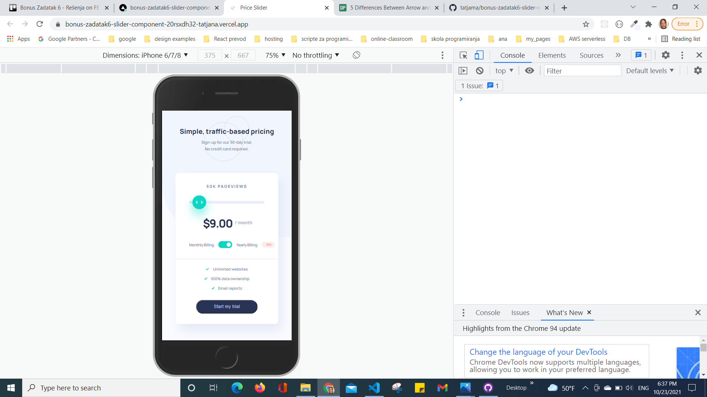

**To do this challenge, you need a basic understanding of HTML, CSS and JavaScript.**

## The challenge

Your challenge is to build out this interactive pricing component and get it looking as close to the design as possible.

Your users should be able to:

- View the optimal layout for the app depending on their device's screen size
- See hover states for all interactive elements on the page
- Use the slider and toggle to see prices for different page view numbers (details provided below)

### Page view and pricing totals

Here are the different page view ranges and the corresponding monthly price totals:

- 10K pageviews / $8 per month
- 50K pageviews / $12 per month
- 100K pageviews / $16 per month
- 500k pageviews / $24 per month
- 1M pageviews / $36 per month

If the visitor switches the toggle to yearly billing, a 25% discount should be applied to all prices.

## Where to find everything

Your task is to build out the project to the designs inside the `/design` folder. You will find both a mobile and a desktop version of the design. 

You will find all the required assets in the `/images` folder. The assets are already optimized.

There is also a `style-guide.md` file containing the information you'll need, such as color palette and fonts.

## Building your project

Initialize your project as a public repository on [GitHub](https://github.com/).

## Deploying your project

[Vercel](https://vercel.com/)

**Have fun building!** 🚀
# Tatjana Marković Frontend Mentor Crowdfunding product page

## Table of contents

  - [Overview](#overview)
  - [The challenge](#the-challenge)
  - [Screenshot](#screenshot)
  - [Links](#links)
  - [My process](#my-process)
  - [Built with](#built-with)
  - [Author](#author)

## Overview

- On first load
  1. Show Initial Values 

- App behavior
  1. User can choose how to pledge project with or without reward. 
      -  With reward -User have to pledge minimum value for that reward,
      -  No reward - any values 
  2. When some rewards are not available ( = 0), user can't choose it anymore and this item is shown as faded.
  3. When user successfully pledge minimum value thanks message is shown.
  4. The reward stock is reduced by one, new backer is added, pledge amount is increased by new pledge, and slider is updated accordingly

## The challenge

Your challenge is to build out this crowdfunding product page and get it looking as close to the design as possible.

Your users should be able to:

- View the optimal layout depending on their device's screen size
- See hover states for interactive elements
- Make a selection of which pledge to make
- See an updated progress bar and total money raised based on their pledge total after confirming a pledge
- See the number of total backers increment by one after confirming a pledge
- Toggle whether or not the product is bookmarked

### Screenshot

### Links

- Solution URL: [GitHub](https://github.com/tatjama/zadatak6-crowdfunding-product-page/tree/develop)
- Preview: [Vercel](https://zadatak6-crowdfunding-product-page-50ctwoiki-tatjana.vercel.app/)
- Live Site URL: [Vercel](https://zadatak6-crowdfunding-product-page.vercel.app/)

## My process

1. Create a new project
2. Import starting code
3. Initializing git repositories main and develop
4. Import git repositories to the Vercel project
5. Create HTML structure
6. Create CSS Utility
7. Style for Desktop
8. Responsive Mobile
9. Create JavaScript Behavior for Pages
. Responsive Mobile and Tablet style
10. Refactoring
11. Manual Test for bugs
14. Compare original designs with my work
15. Create screenshots
16. Change README-template.md to README.md
17. Open Pull request
18. Solve Issue
19. Merge develop branch into master branch
### Built with

1. Semantic HTML5 markup
2. CSS custom properties
- FlexBox
- Media queries
- Centering elements, content and text
- Element positioning
- Customize font,width and size
- Hover
- CSS variables
- z-index
- gradient
3. JavaScript
- DOM manipulation   
- Event handling
- Classes
## Author

- Website - [Tatjana Markovic](https://my-react-portfolio-tatjana.vercel.app/)
- LinkedIn - [Tatjana Marković](https://www.linkedin.com/in/tatjana-markovi%C4%87-919501189/)
- GitHub - [tatjama](https://github.com/tatjama)

